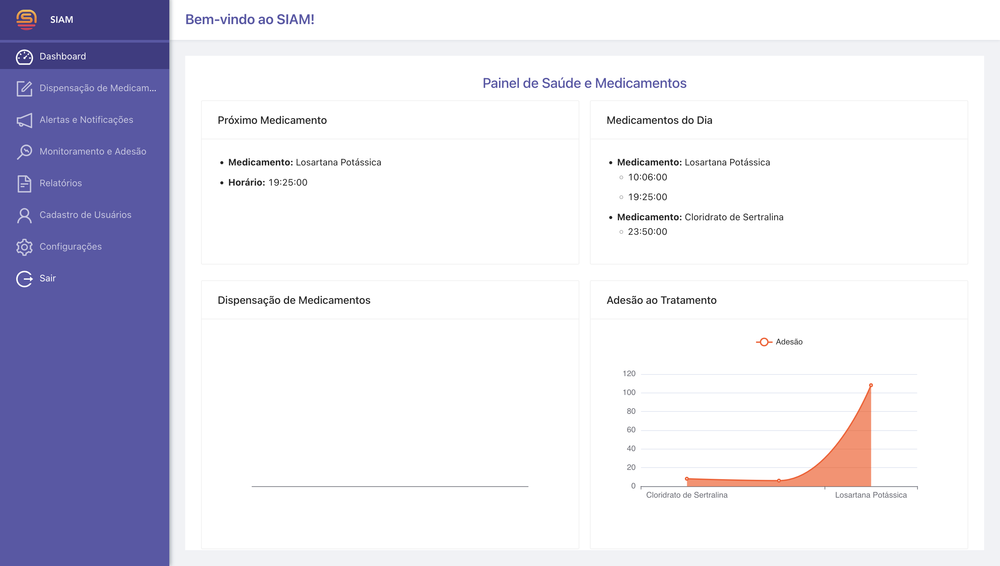
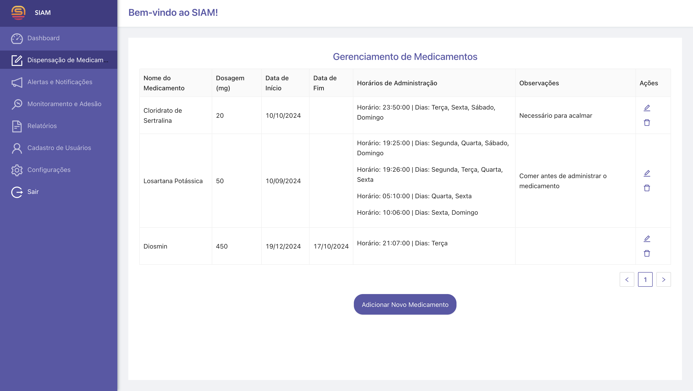
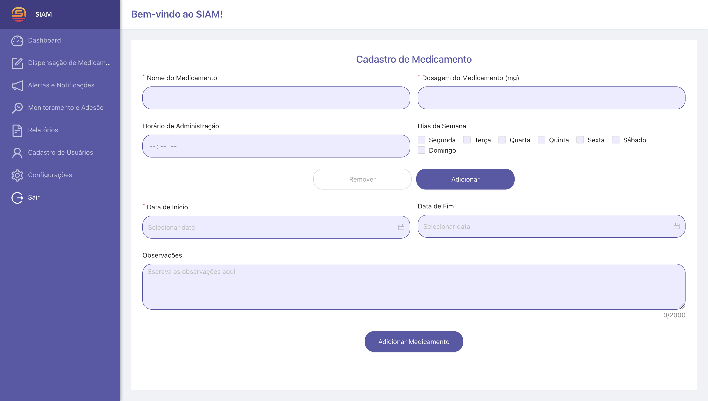
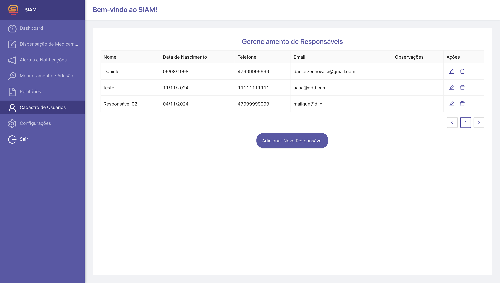

# SIAM - Sistema Inteligente de Administração de Medicamentos
[](#)
[](#)
[](#)
[](#)
[](#)
[](#)
[](#)
[](#)
[](#)

## Visão Geral

O **SIAM (Sistema Inteligente de Administração de Medicamentos)** é um projeto voltado para a automação e monitoramento da dispensação de medicamentos, especialmente direcionado para o cuidado de idosos. O objetivo principal é facilitar a administração correta dos medicamentos em horários específicos, proporcionando maior segurança e precisão, além de garantir que os idosos tomem seus remédios na dosagem e no tempo corretos.

<p align="center">
  <p>
    
    
  </p>
  <p>
    
    
  </p>
    <p>
    
    
  </p>
    <p>
    
    
  </p>
    <p>
    
    
  </p>
</p>

## Objetivos do Projeto

1. **Automação da Dispensação**: O sistema é capaz de controlar a dispensação de medicamentos de forma automatizada, reduzindo erros humanos na dosagem e no horário.
2. **Monitoramento em Tempo Real**: Oferece monitoramento contínuo da dispensação, registrando as interações e o cumprimento dos horários estabelecidos.
3. **Notificações**: Envia alertas sonoros para garantir que o usuário não perca a hora de tomar seus medicamentos.

## Funcionalidades

- **Controle de Horários**: Configuração de horários específicos para cada medicamento.
- **Acompanhamento de Consumo**: O sistema armazena um histórico de quando os medicamentos foram dispensados e ingeridos.
- **Alertas**: Notificações sonoras quando está na hora de tomar o medicamento.
- **Interface de Gerenciamento**: Uma interface onde o cuidador ou usuário pode ajustar a configuração de medicamentos, visualizar relatórios e administrar o sistema.
- **Impressão 3D para Prototipagem**: Uso de impressoras 3D para criar um protótipo físico do dispensador de medicamentos automatizado.

## Tecnologias Utilizadas

- **Angular**: Frontend da aplicação responsável pela interface de gerenciamento do sistema.
- **Backend NodeJS**: API para comunicação e controle do dispensador.
- **PostegreSQL**: Banco de dados para armazenamento dos dados.
- **Dispositivos IoT**: Sensores e atuadores para controlar a dispensação física dos medicamentos.
- **Impressora 3D**: Para criação do protótipo físico do dispensador automatizado.

## Requisitos Funcionais

1. **Cadastro de Medicamentos**: O usuário pode cadastrar os medicamentos e seus horários de administração.
2. **Automação de Dispensação**: Dispensar automaticamente a dosagem correta no horário configurado.
3. **Monitoramento Remoto**: Permitir que cuidadores acompanhem remotamente o estado de dispensação dos medicamentos.
4. **Histórico de Dispensação**: Registro de todas as doses dispensadas para auditoria e acompanhamento.
5. **Relatório de Uso**: Realizar download em CSV ou XLSX para relatório.
6. **Cadastrar Cuidadores, Familiares ou Responsáveis**: Permitir cadastrar cuidadores, familiares ou responsáveis.
7. **Envio de Email**: Enviar email para os cuidadores cadastrados informando que X medicamento não foi administrado.

## Requisitos Técnicos

- **Plataforma Web**: A aplicação deve ser acessível via navegador.
- **Integração com Dispositivos**: O sistema deverá se integrar a dispositivos físicos que realizam a dispensação.
- **Notificações**: Sistema de envio de notificações.
- **Criptografia de Dados**: Sistema de criptografia em JWT.
- **Autenticação e Autorização**: Sistema de criptografia em JWT.

## Ferramentas de Desenvolvimento e de Gestão do Projeto

- **Git e GitHub**: Sistema de controle de versionamento e hospedagem dos repositórios.
- **Visual Studio Code**: Editor de código-fonte para frontend e backend.
- **Arduino IDE**: Editor de código-fonte do ESP32.
- **Jira**: Organização de tarefas e acompanhamento de progresso.
- **Docker**: Utilizado para criar contêiners que encapsulam o ambiente de execução da aplicação.
- **CI/CD**: Feito pelo GitHubActions.

## Diagrama de Arquitetura

<p align="center">
  <p>
    
  </p>
</p>

## Pré-requisitos

Para executar este projeto localmente, é necessário ter instalado:

- Node.js
- npm (Node Package Manager)
- Arduino IDE
- PostgreSQL

## Inicializando o projeto

- Clone o repositório para sua máquina:

```bash
git clone https://github.com/DaniOrze/SIAM.git
```

- Navegue até a pasta do projeto:

```bash
cd SIAM
```

### Rodando o Frontend

- Navegue até a pasta do frontend:

```bash
cd siam-frontend
```

- Instale as dependências:

```bash
npm install
```

- Execute a aplicação:

```bash
npm start
```

A aplicação será iniciada no navegador padrão em: `http://localhost:4200`

### Rodando o Backend

- Navegue até a pasta do backend:

```bash
cd siam-backend
```

- Instale as dependências:

```bash
npm install
```

- Execute a aplicação:

```bash
npm run dev
```

A aplicação será iniciada no navegador padrão em: `http://localhost:3000`

### Rodando o Banco de Dados

- Certifique-se de ter o PostgreSQL instalado.

- Crie um banco de dados no PostgreSQL:

```bash
CREATE DATABASE siam;
```

- Execute o arquivo SQL localizado na pasta migrations para criar as tabelas e configurações iniciais:

```bash
psql -U <seu_usuario> -d siam -f migrations/schema.sql
```

- Substitua <seu_usuario> pelo nome do usuário do PostgreSQL.

- Atualize as configurações do banco de dados no arquivo .env na pasta do backend para refletir suas credenciais.

### Rodando o Arduino

- Navegue até a pasta do arduino:

```bash
cd siam-arduino
```

- Instale as dependências e suba o projeto através do micro-usb para o ESP32.

## Executando o projeto com Docker

- Copie o arquivo .env.example para .env:

```bash
cp .env.example .env
```

- Suba os containers usando o Docker Compose:

```bash
docker compose up -d
```

- Isso irá inicializar o frontend, backend e banco de dados automaticamente.

- A aplicação frontend será iniciada no navegador padrão em: `http://localhost:4200`
- A aplicação backend será iniciada no navegador padrão em: `http://localhost:3000`


## Contribuições

Contribuições são bem-vindas! Sinta-se à vontade para abrir uma issue ou enviar um pull request para o repositório

## Licença

Este projeto está licenciado sob a licença [MIT](./LICENSE).